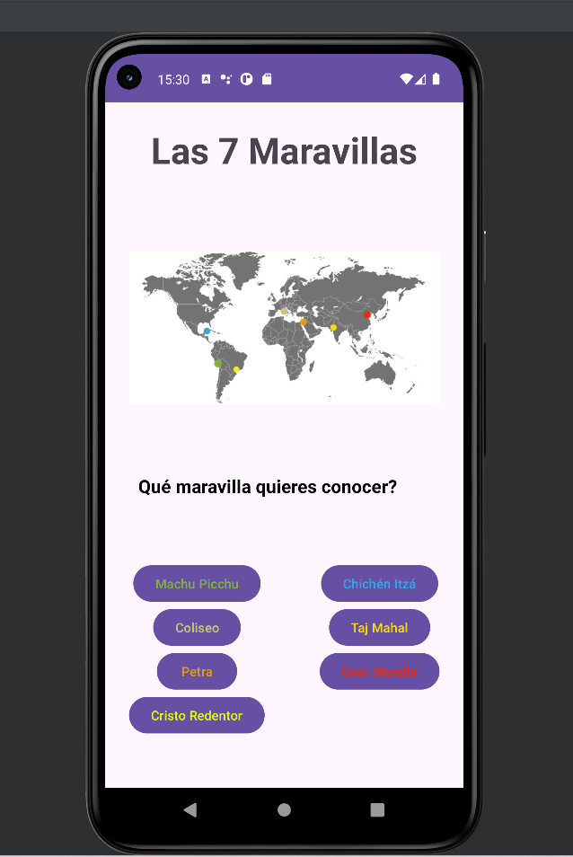
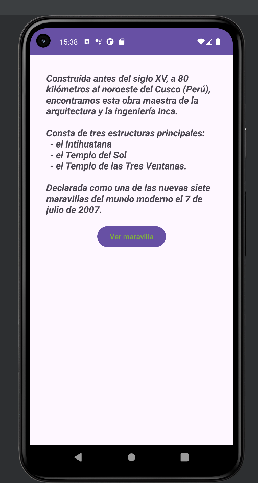
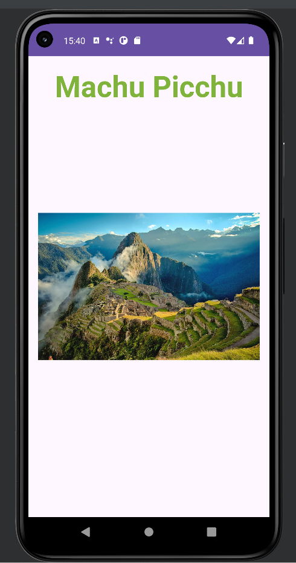

## DESIGN DOCUMENT

Creado por:  Gonzalo Pulleiro Juncal 

Versión del documento:  1.00 

## HISTORIAL DE REVISIONES

| Versión | Fecha | Comentarios |
| --- | --- | --- |
| 1.00 |  01/05/2024  | Creación del documento |

## PRESENTACIÓN

### Título

> LAS 7 MARAVILLAS

### Concepto

> Aplicación realizada en AndroidStudio con una funcionalidad muy básica. Proporcionar información sencilla sobre las 7 maravillas del mundo moderno, según National Geographic,
junto con una imágen de cada una de ellas.

### Navegación

> Pantalla principal:
- Título de la aplicación
- Mapamundi, con puntos de colores marcados, intentando dar la localización de las maravillas.
- Un cuadro de texto que pregunta al usuario que maravilla quiere conocer.
- 7 botones, representando cada uno de ellos una maravilla.

> Pantallas secundarias:
- Una vez pulsamos sobre alguno de los botones, veremos una breve información a cerca de esa maravilla,
junto con un botón que al pulsar nos pasará a una siguiente pantalla en la cual veremos la imágen de la maravilla.
Un ejemplo: 

> Última pantalla:
- Aquí veremos la imágen de la maravilla junto con el nombre de la misma. 

> Para volver al inicio solamente tendremos que pulsar sobre el botón "Atrás" y listo.

> Es una aplicación muy básica y muy sencilla. La pantalla inicial es común, obviamente, pero después una 
vez pulses sobre cada botón, pasamos a diferentes fragmentos, uno por cada información de la maravilla y
uno por cada foto. 